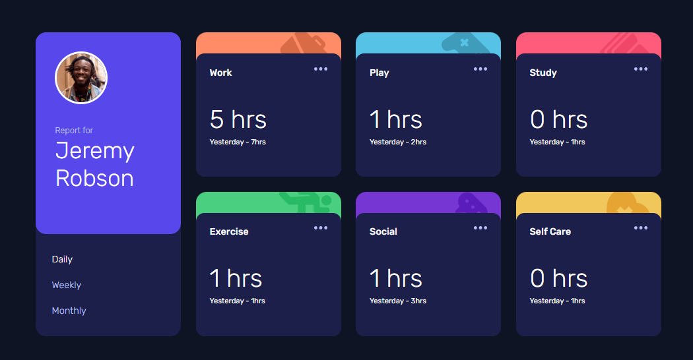
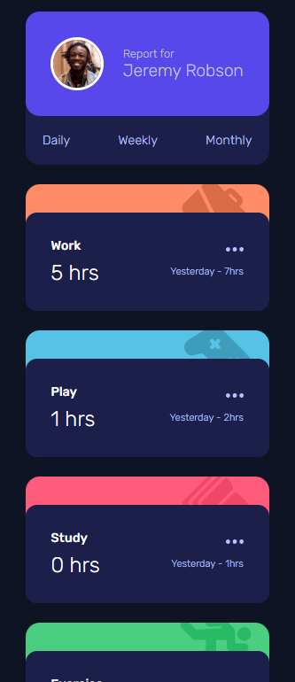

# Frontend Mentor - Time tracking dashboard solution

This is a solution to the [Time tracking dashboard challenge on Frontend Mentor](https://www.frontendmentor.io/challenges/time-tracking-dashboard-UIQ7167Jw). Frontend Mentor challenges help you improve your coding skills by building realistic projects.

## Table of contents

- [Overview](#overview)
  - [The challenge](#the-challenge)
  - [Screenshot](#screenshot)
  - [Links](#links)
- [My process](#my-process)
  - [Built with](#built-with)
  - [What I learned](#what-i-learned)
  - [Continued development](#continued-development)
  - [Useful resources](#useful-resources)
- [Author](#author)

**Note: Delete this note and update the table of contents based on what sections you keep.**

## Overview

### The challenge

Users should be able to:

- View the optimal layout for the site depending on their device's screen size
- See hover states for all interactive elements on the page
- Switch between viewing Daily, Weekly, and Monthly stats

### Screenshot

### Links

- Solution URL: [Add solution URL here](https://your-solution-url.com)
- Live Site URL: [Add live site URL here](https://your-live-site-url.com)

## My process

### Built with

- Semantic HTML5 markup
- CSS custom properties
- Flexbox
- CSS Grid
- Mobile-first workflow

### What I learned

JSON. JSON. JSON. Prior to this challenge I used the MDN Documentation to learn the basic of JSON. That short tutorial, some light practice, and Frontend Mentor's introduction to JSON thoroughly prepared me for this challenge.

- I learned how to use JSON with a local file.
- I learned how to structure my HTML and CSS more effectively
  -I learned that breaking down complex JS issues into bite sized ones is the most effective

### Continued development

Things I want to work on:

- Mobile First Design
- JSON
- Javascript
- CSS selectors and specificity

### Useful resources

- [MDN](https://developer.mozilla.org/en-US/docs/Learn_web_development/Core/Scripting/JSON) - This helped me learn the JSON basics!

## Author

- GitHub - [@christencodes](https://github.com/christencodes)
- Frontend Mentor - [@christencodes](https://www.frontendmentor.io/profile/christencodes)
- Twitter - [@christencodes](https://x.com/christencodes)
